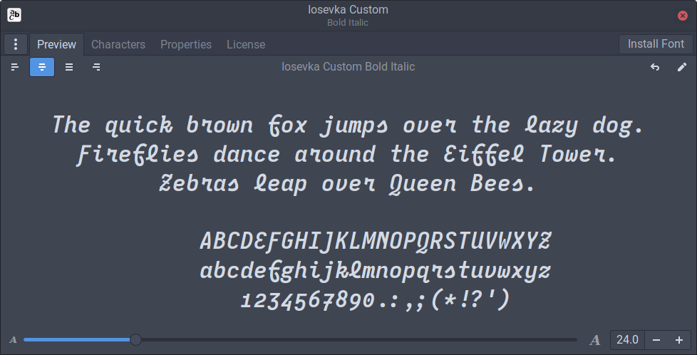

# Custom Iosevka "Cursive" Font

Follow the Iosevka [Custom Build Instructions](https://github.com/be5invis/Iosevka/blob/main/doc/custom-build.md) with this [private-build-plans.toml]() file to generate the initial fonts. The Normal and Bold variants are used as-built. The Italic and Bold-Italic fonts are customized, as described below.

## Customizations using FontForge

After the fonts were built, the following changes were made using FontForge:

* Latin Capital Letter Open E (U+0190) was copied into Latin Capital Letter E (U+0045).
* Latin Capital Letter F With Hook (U+0191) was copied into Latin Capital Letter F (U+0046).

From Cascadia Code, the following glyphs were copied:

* Alternate Letter Form f.salt (0x10015) was copied into Latin Small Letter F (U+0066).
* Alternate Letter Form l.salt (0x10016) was copied into Latin Small Letter L (U+006C).
* Alternate Letter Form r.salt (0x10021) was copied into Latin Small Letter R (U+0072).
* Alternate Letter Form s.salt (0x10023) was copied into Latin Small Letter S (U+0073).

Cascadia Code SemiBold Italic was used for Iosevka Bold Italic. Cascadia Code Light Italic was used for Iosevka Italic, after changing weight by 21 em units in the Outline Window of FontForge.

Glyphs from Cascadia Code were sized to 50% after copying to align with the Iosevka grid.

### Glyph Alignment

Glyph Outlines were copied using FontForge's Outline Window, with both fonts open from the same instance of FontForge.

* For Latin Small Letter F, the top right point of the crossbar of the Cascadia Code glyph was snapped to the same point of the Iosevka glyph.
* For Latin Small Letter L, the bottom-most point of the Cascadia Code glyph was snapped to the same point of the Iosevka glyph, and then the new glyph was moved to the right (using `<Shift-Right Arrow>`) until the top-most points of the two glyphs were aligned vertically.
* For Latin Small Letter R, the top right corner point of the Cascadia Code glyph was snapped to the same point of the Iosevka glyph.
* For Latin Small Letter S, the bottom center point of the Cascadia Code glyph was snapped to the same point of the Iosevka glyph.

After the Cascadia Code glyphs were copied into corresponding Iosevka glyph, the original glyph was deleted. AutoHints were added to clean up old hinting.

### Additional Tweaks

* For the Latin Small Letter R, the upstroke was shortened. A point was added on each of the upwardly curving splines as follows:
	- Select the two points on the inner spline and add a point: `Point > Insert Point On Spline At...`, setting the X position to midway up the curve.
	- Using a T-Square or other method to measure a right angle, determine the X position on the outer spline which forms a right angle to the tangent at the point just created.
	- Select the two points on the outer spline and add a point, setting the X position to that determined in the previous step.
	- Delete the points below the two just added, and add a line between these two points to finish the curve.
* For the Latin Small Letter S, the upstroke was curved inward:
	- The 5 upstroke points, including the top left point, but not its corresponding "inside" point, were selected, with the top left being the last picked.
	- A transformation was applied, with the origin `Last Press` (the top left node): rotate 10° Withershins (_sic_).
	- This brought the upstroke closer to the body of the letter, making it blend better with tailed letters before it.

## Character Maps

